# Отчет по лабораторной работе №1

**Автор**: Наумцев Аелксандр

**Группа**: Б05

# Questions

## Exercise 1
>Run ./fork.py -s 10 and see which actions are taken. Can you
predict what the process tree looks like at each step? Use the -c
flag to check your answers. Try some different random seeds (-s)
or add more actions (-a) to get the hang of it.

Запускаем процес a, с начальными данными (ARG). Текстовое описание работы процессов, создание кого и кем.

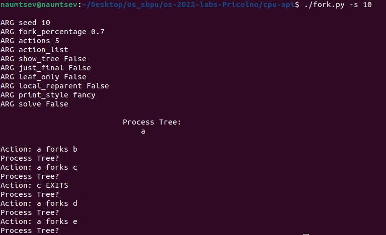

Применияя с ключом -c, наблюдаем согласованность построеного дерева.

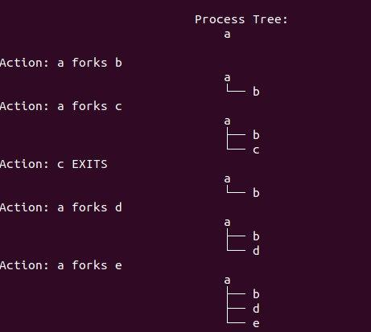

## Exercise 2
>One control the simulator gives you is the fork percentage, controlled by the -f flag. The higher it is, the more likely the next
action is a fork; the lower it is, the more likely the action is an
exit. Run the simulator with a large number of actions (e.g., -a
100) and vary the fork percentage from 0.1 to 0.9. What do you
think the resulting final process trees will look like as the percentage changes? Check your answer with -c

-a отвечает за количество первых действий, которые нам покажут.
-f [0.1 .. 0.9] - вероятность вилки (fork).

Картинки вставлять бесполезно, они большие.
Если f маленькое, то развлетлений будет очень мало, и деревья будут не глубокие, они будут exit'cя , быстрее чем создаваться.

И если f больше, напротив у всех степень вершин будет большая, тем самым мы увидим только небольшую глубину дерева, так как на глубине 1-2-3 будет ОЧЕНЬ много происходить действий (вилок будет больше удалений).

Хочу заметить интересное наблдение 
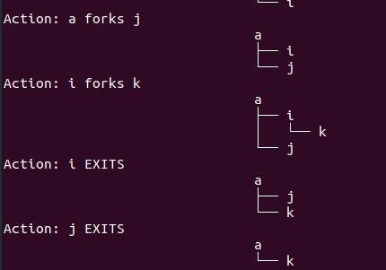
Мы видим как родитель (i) ребёнка (k) удаляется, и k присоединяется к вершине (a) выше. 

## Exercise 3
>Now, switch the output by using the -t flag (e.g., run ./fork.py
-t). Given a set of process trees, can you tell which actions were
taken?

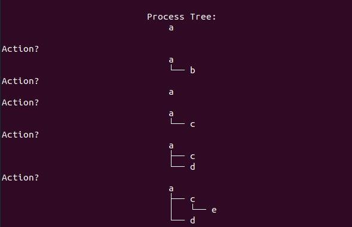

На в этом сценарии процессе 

- a fork b
- exit b
- a fork b 
- a fork d
- c fork e

## Exercise 4
>One interesting thing to note is what happens when a child exits;
what happens to its children in the process tree? To study this, let’s
create a specific example: ./fork.py -A a+b,b+c,c+d,c+e,c-.
This example has process ’a’ create ’b’, which in turn creates ’c’,
which then creates ’d’ and ’e’. However, then, ’c’ exits. What do
you think the process tree should like after the exit? What if you
use the -R flag? Learn more about what happens to orphaned processes on your own to add more context.

Вывод без ключа -R
Дети у родителя при удалении крепятся к начальному процессу(a) 

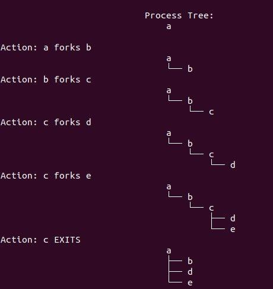

Вывод с ключом -R

Дети у родителя при удалении крепятся к следущему родителю вверх (у процесса один родитель) процессу (b). 

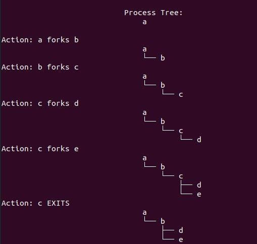

По моему мнению второй исход более логичный, НО в компьютерном смысле это видимо правильнее потому что перед тем как умиреть детям они отдаются в право главного процессора и он решает с специальным сигналом. Он уже решит, что делать с зомби процессом.
Например,  если родитель ищет информацию, а ребёнок сохраняет в файл. Тут главный процессор должен решить что делать с файлом, при смерти родителя, записать что есть или все откатить, или что нибудь еще. 

## Exercise 5
>One last flag to explore is the -F flag, which skips intermediate
steps and only asks to fill in the final process tree. Run ./fork.py
-F and see if you can write down the final tree by looking at the
series of actions generated. Use different random seeds to try this a
few times.

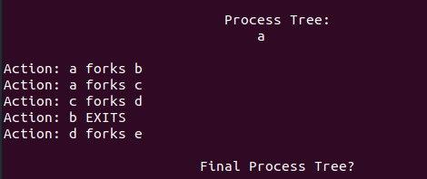

- a(b)
- a(bc)
- a(bc(d))
- a(c(d))
- a(c(d(e)))

## Exercise 6
>Finally, use both -t and -F together. This shows the final process
tree, but then asks you to fill in the actions that took place. By looking at the tree, can you determine the exact actions that took place?
In which cases can you tell? In which can’t you tell? Try some different random seeds to delve into this question.

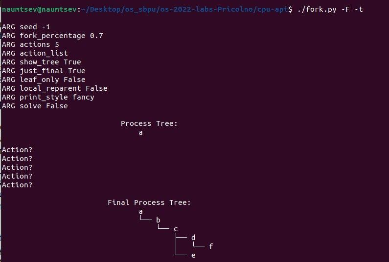

Здесь происходят только fork, но неясно в какой последовательно,  создавались подветви (с).

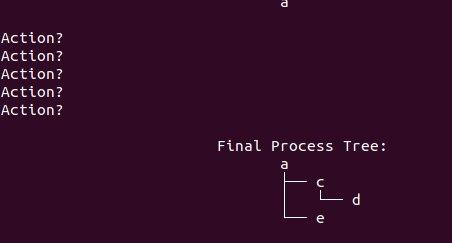

Или например здесь, тут есть exit, но не ясно когда и где он был.
Понятно, что далее может быть гораздо больше вариантов, что может произойти и какие варианты работы процессов были. Поэтому по количество действий и финальному дерево много чего останется неясным.

# Code

## Exercise 1
>Write a program that calls fork(). Before calling fork(), have the
main process access a variable (e.g., x) and set its value to something (e.g., 100). What value is the variable in the child process?
What happens to the variable when both the child and parent change
the value of x?

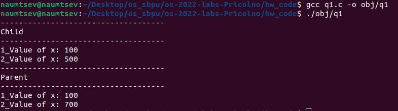

Как мы видим, родитель и ребенок не перезатирают значения x, значит для каждого процесса выделяется своя отдельная память. 

## Exercise 2
>Write a program that opens a file (with the open() system call)
and then calls fork() to create a new process. Can both the child
and parent access the file descriptor returned by open()? What
happens when they are writing to the file concurrently, i.e., at the
same time?

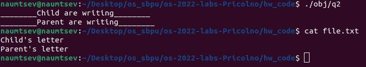

Как мы видим, ребёнок и родитель оба имеют доступ к открытому файлу. Благодря wait() можем контролировать порядок записи.

## Exercise 3
>Write another program using fork(). The child process should
print “hello”; the parent process should print “goodbye”. You should
try to ensure that the child process always prints first; can you do
this without calling wait() in the parent?

Да, можно так сделать, например использовать файл buffer - флаг конца работы ребёнка, в это время гонять по циклу родителя. Возможно в цикл нужно засунуть sleep, чтобы избежать работы одного только родителя и давать поработать ребёнку. 

## Exercise 4
>Write a program that calls fork() and then calls some form of
exec() to run the program /bin/ls. See if you can try all of the
variants of exec(), including (on Linux) execl(), execle(),
execlp(), execv(), execvp(), and execvpe(). Why do
you think there are so many variants of the same basic call?

EXEC
Различие между этими командами заключается, 

- c параметрами l v - разрешается вводить аргументы в виде list и vector
- c парметром p - позволяет искать исполняемый файл дополнительно в PATH

Удобно иметь возможность вызывать с разными типами аргументов. Иногда нужно искать исполняемый файл в PATH, но можно придумать сценарий когда это все сломает. 

## Exercise 5
>Now write a program that uses wait() to wait for the child process
to finish in the parent. What does wait() return? What happens if
you use wait() in the child?

wait - возращает индификатор дочернего процесса, иначе (отсутствия детей) выдаёт -1, что и получили.

## Exercise 6
>Write a slight modification of the previous program, this time using waitpid() instead of wait(). When would waitpid() be
useful?

waitpid() - позволяет ждать завршение определённого процесса.
Полезно когда нам важно понимать когда и какой процес закончился.

## Exercise 7
>Write a program that creates a child process, and then in the child
closes standard output (STDOUT FILENO). What happens if the child
calls printf() to print some output after closing the descriptor?

После завершиения stdout ребёнком, ничего не напишется в этом процессе. НО никакой ошибки не произойдет.

## Exercise 8
>Write a program that creates two children, and connects the standard output of one to the standard input of the other, using the
pipe() system call.

